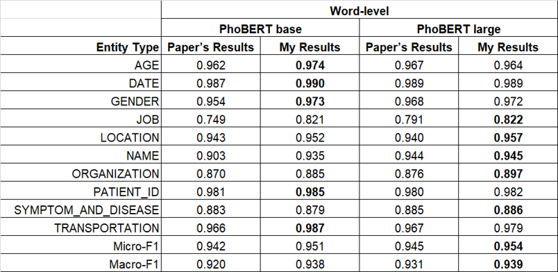

# **COVID-19-Named-Entity-Recognition-for-Vietnamese**

## 👋 **Introduction**
A Pytorch replication of the paper [COVID-19 Named Entity Recognition for Vietnamese](https://arxiv.org/abs/2104.03879).\
My trained weights are available at [here](https://drive.google.com/drive/folders/1oN2Mr44jwjNKxqUE2t2UgTlXWfXf6ojy?usp=sharing) and the results are shown in the following table:
> 

## 🚀 **Quick Start**
How to train on your custom data? Very easy!!!

### **1. Create dataset.yaml**
[data/PhoNER/phoner.yaml](data/PhoNER/phoner.yaml), shown below, is the dataset config file that defines:
- absolute paths to `train` / `val` / `test` annotation files.
- the number of tags `num_tags`.
- a list of tag names.
```bash

test_df_path: ../data/PhoNER/test_word.csv
train_df_path: ../data/PhoNER/train_word.csv
val_df_path: ../data/PhoNER/val_word.csv

num_tags: 20
tag_names: [
  "B-AGE", 
  "B-DATE", 
  "B-GENDER", 
  "B-JOB", 
  "B-LOCATION", 
  "B-NAME", 
  "B-ORGANIZATION", 
  "B-PATIENT_ID", 
  "B-SYMPTOM_AND_DISEASE", 
  "B-TRANSPORTATION", 
  "I-AGE", 
  "I-DATE", 
  "I-JOB", 
  "I-LOCATION", 
  "I-NAME", 
  "I-ORGANIZATION", 
  "I-PATIENT_ID", 
  "I-SYMPTOM_AND_DISEASE", 
  "I-TRANSPORTATION", 
  "O", 
]
```

### **2. Organize annotations**
Organize your `train` / `val` / `test` annotation files to the dataframe format, with one `*.csv` file per set. The `*.csv` file specifications are:
- One pair (`word`, `tag`) per row.
- Words belonging to the same sentence have the same `sentence_id`.

### **3. Put hyperparameters in the config file**
[source/hyps.yaml](source/hyps.yaml), shown below, is the hyperparameters config file:
```bash

device: "cuda"
device_ids: [0, 1]
num_workers: 4
batch_size: 32
model: "vinai/phobert-base"
use_crf: True
lr: 5e-5
epochs: 30
```

### **4. Run**
Main commands:
```bash
cd source/

# Train
python train.py --data_file "../data/PhoNER/phoner.yaml" --hyps_file "hyps.yaml"
# Test
python test.py --data_file "../data/PhoNER/phoner.yaml" --hyps_file "hyps.yaml"
```